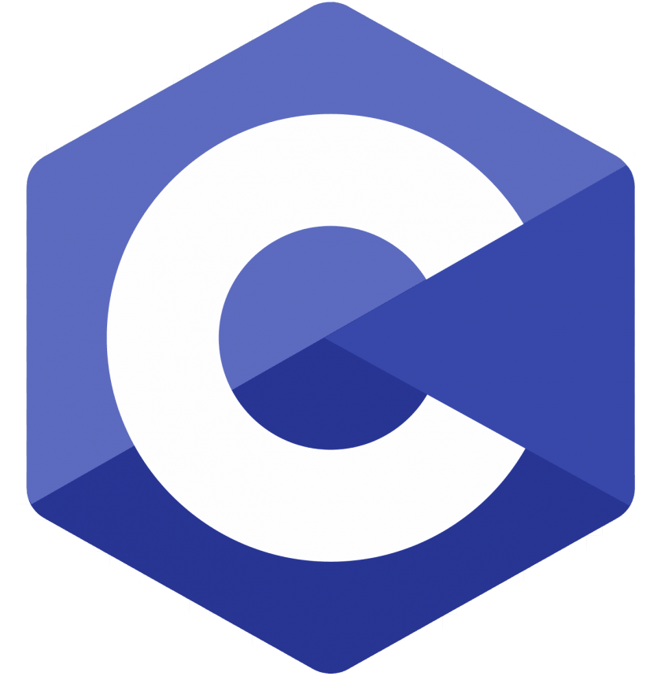
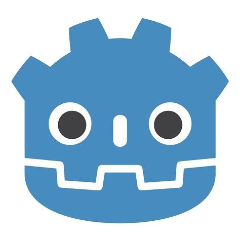
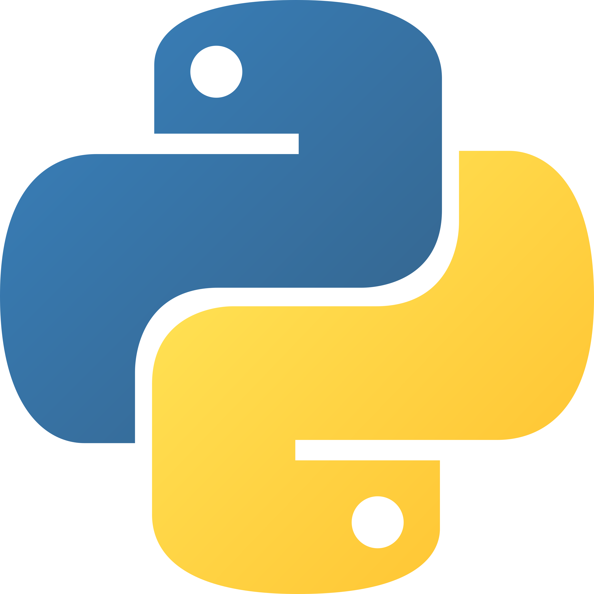
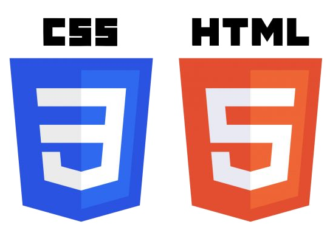

# Good day :smile:
Welcome to my GitHub page

</img>

## What I like :heart:

### To make
I like to make games and low level programs.  

### To use
My favourite coding language is Brain F*ck,  
but if I want to make something bigger I use Godot

### To develop
I love to develop systems frames and make the core of programs.

</img>

## What I code in :computer:

Mostly I use Godot and VScode.  
Some of the coding languages I can:  
* C  
* HTML / CSS  
* GDscript  
* Python  
* Brain F*ck  

           </img>
       </img>
      </img>
</img>

</img>

## Contact

If you have any questions regarding me or anything with coding  
feel free to send an email to [thomasantalcsipa@gmail.com](thomasantalcsipa@gmail.com).

## Thank you for your time :heart:
