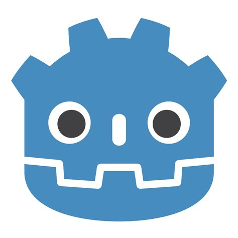

Good day

What I like

I like to make games and low level programs.  
My favourite coding language is Brain F*ck  
and I love to develop systems and make the core of programs.

What I code in

Mostly I use Godot and VScode.  
Some code languages I can:  
* C  
* Brain F*ck  
* GDscript  
* Python  
* HTML / CSS  

     </img>
 </img>
</img>

